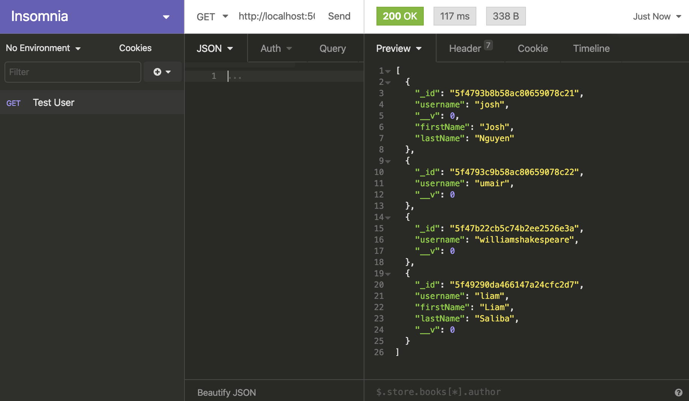

# Implementation of the Server

This directory contains files and modules that implement the server of our ePortfolio. On a local machine, the URL of the server is http://localhost.com:5000.

To run the server, you need the ```.env``` file that specifies the URI of our MongoDB database, and ensure that ```.env``` is in the same directory as ```server.js```. Then run this command on bash:

```bash
$ node server.js
```

For continuous update as you write code, run this instead:

```bash
$ nodemon server.js
```

If you encounter errors due to some new packages not being installed by npm, do this:

```bash
$ cd ..
$ npm install
```

To test the server, I recommend you [download](https://insomnia.rest/download/) the app Insomnia (Core version) and test your requests there. 

- When running the server, e.g., make a ```GET``` request to ```http://localhost:5000/user/``` to see the JSON object of all users currently stored in the database. It will look something like this:
